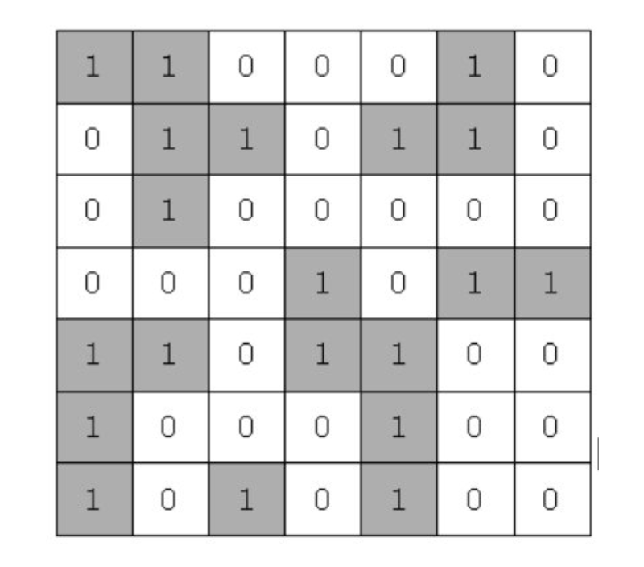

## 문제

###  섬나라 아일랜드(BFS)

#### 설명
```
N*N의 섬나라 아일랜드의 지도가 격자판의 정보로 주어집니다.

각 섬은 1로 표시되어 상하좌우와 대각선으로 연결되어 있으며, 0은 바다입니다.

섬나라 아일랜드에 몇 개의 섬이 있는지 구하는 프로그램을 작성하세요.
```



```
만약 위와 같다면 섬의 개수는 5개입니다.
```

#### 입력
```
첫 번째 줄에 수열의 길이인 자연수 N(5<=N<100,000)이 주어집니다.

두 번째 줄에 N길이의 0과 1로 구성된 수열이 주어집니다.
```

#### 출력
```
첫 줄에 최대 길이를 출력하세요.
```

#### 예시 입력
- 입력
    ```
    14 2
    1 1 0 0 1 1 0 1 1 0 1 1 0 1
    ```
- 출력
    ```
  8    
  ```
