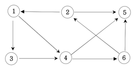

## 문제

### 그래프 최단거리(BFS)

#### 설명
   

```
다음 그래프에서 1번 정점에서 각 정점으로 가는 최소 이동 간선수를 출력하세요.
```

#### 입력
```
첫째 줄에는 정점의 수 N(1<=N<=20)와 간선의 수 M가 주어진다. 그 다음부터 M줄에 걸쳐 연 결정보가 주어진다.
```

#### 출력
```
1번 정점에서 각 정점으로 가는 최소 간선수를 2번 정점부터 차례대로 출력하세요.
```

#### 예시 입력
- 입력
    ```
    6 9 
    1 3 
    1 4 
    2 1
    2 5
    3 4
    4 5
    4 6
    6 2
    6 5
    ```
- 출력
    ```
    2 : 3
    3 : 1
    4 : 1
    5 : 2 
    6 : 2
    ```